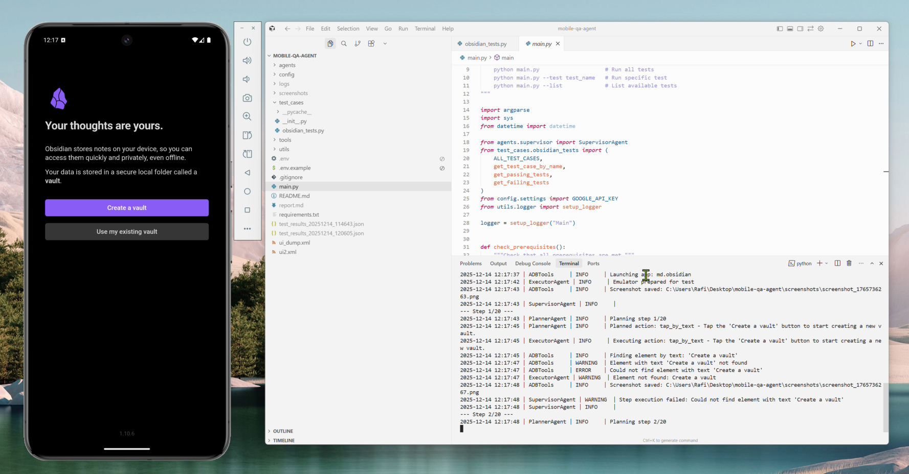

# Mobile QA Multi-Agent System

A multi-agent system for automated mobile QA testing of the Obsidian app on Android, built with Google's Agent Development Kit (ADK) and Gemini.

---

## Demo Video

<div align="center">
  
  <br>
  <a href="https://saluki-my.sharepoint.com/:v:/g/personal/taminul_islam_siu_edu/IQC46B7lLo-bTZaWxiecEb0dAXQeOLVHXKWCa53rfUx1gUo?nav=eyJyZWZlcnJhbEluZm8iOnsicmVmZXJyYWxBcHAiOiJPbmVEcml2ZUZvckJ1c2luZXNzIiwicmVmZXJyYWxBcHBQbGF0Zm9ybSI6IldlYiIsInJlZmVycmFsTW9kZSI6InZpZXciLCJyZWZlcnJhbFZpZXciOiJNeUZpbGVzTGlua0NvcHkifX0&e=VoZaQJ">
    
  </a>
  <p><i>Click the image above to watch the demo video</i></p>
</div>

---

## Overview

This project implements a **Supervisor-Planner-Executor** multi-agent architecture to execute natural language QA test cases on the Obsidian mobile app running in an Android emulator.

### Key Features

- **Multi-Agent Architecture**: Supervisor, Planner, and Executor agents working in coordination
- **Vision-Based Testing**: Uses Gemini's vision capabilities to analyze screenshots
- **Natural Language Test Cases**: Write tests in plain English
- **Accurate Reporting**: Correctly identifies passing and failing tests
- **Reasoning Loop**: Distinguishes between step failures and test assertion failures
- **Modular Design**: Easy to swap LLM models via configuration

## Architecture

```
+-------------------------------------------------------------+
|                     SUPERVISOR AGENT                        |
|  - Orchestrates test execution                              |
|  - Manages agent coordination                               |
|  - Logs final results (Pass/Fail)                           |
|  - Distinguishes step failures vs test assertion failures   |
+-----------------------------+-------------------------------+
                              |
          +-------------------+-------------------+
          v                                       v
+---------------------+               +---------------------+
|   PLANNER AGENT     |               |   EXECUTOR AGENT    |
| - Analyzes screen   |<------------->| - Executes ADB      |
| - Decides actions   |               |   commands          |
| - Uses Gemini       |               | - Captures screens  |
|   vision            |               | - Reports status    |
+---------------------+               +---------------------+
                                                |
                                                v
                                      +---------------------+
                                      |   ADB TOOLS         |
                                      | - tap(x, y)         |
                                      | - tap_by_text()     |
                                      | - type_text(str)    |
                                      | - screenshot()      |
                                      | - swipe()           |
                                      | - press_back()      |
                                      +---------------------+
```

## Quick Start

### Prerequisites

- Python 3.11+
- Android Studio with AVD Manager
- Android Emulator (Pixel 8 Pro, API 34+)
- Obsidian APK installed on emulator
- Gemini API Key (from [Google AI Studio](https://aistudio.google.com/))

### Installation

1. **Clone the repository**
   ```bash
   git clone https://github.com/yourusername/mobile-qa-agent.git
   cd mobile-qa-agent
   ```

2. **Create and activate conda environment**
   ```bash
   conda create -n mobile-qa python=3.11 -y
   conda activate mobile-qa
   ```

3. **Install dependencies**
   ```bash
   pip install -r requirements.txt
   ```

4. **Configure environment**
   ```bash
   # Create .env file with your API key
   echo "GOOGLE_API_KEY=your_api_key_here" > .env
   ```

5. **Start the Android emulator**
   ```bash
   # Windows
   & "$env:ANDROID_HOME\emulator\emulator.exe" -avd Pixel8Pro_API36 -no-snapshot
   ```

6. **Run the demo tests**
   ```bash
   python main.py --demo
   ```

## Usage

```bash
# List all available tests
python main.py --list

# Run demo tests (4 tests: 2 pass, 2 fail)
python main.py --demo

# Run all tests
python main.py --all

# Run a specific test
python main.py --test test_create_vault
```

## Demo Test Cases

| Test Name | Description | Expected Result |
|-----------|-------------|-----------------|
| `test_create_vault` | Create a new vault named 'InternVault' | PASS |
| `test_create_note` | Create note titled 'Meeting Notes' with body 'Daily Standup' | PASS |
| `test_appearance_icon_red` | Verify Appearance accent color is red (it's purple) | FAIL |
| `test_print_to_pdf` | Find 'Print to PDF' in main menu (doesn't exist) | FAIL |

## Project Structure

```
mobile-qa-agent/
├── agents/
│   ├── planner.py      # Analyzes screenshots, plans actions
│   ├── executor.py     # Executes ADB commands
│   └── supervisor.py   # Orchestrates tests, logs results
├── tools/
│   └── adb_tools.py    # ADB interaction utilities
├── test_cases/
│   └── obsidian_tests.py  # Test case definitions
├── config/
│   └── settings.py     # Configuration (model, delays, etc.)
├── utils/
│   └── logger.py       # Logging utilities
├── screenshots/        # Test step screenshots
├── main.py             # Entry point
├── report.md           # Framework decision memo
├── requirements.txt
└── README.md
```

## Evaluation Criteria Met

| Criteria | Implementation |
|----------|----------------|
| **Accurate Reporting** | Supervisor correctly identifies pass/fail with `is_correct` property |
| **Reasoning Loop** | Step failures vs test assertion failures are handled separately (supervisor.py lines 140-144) |
| **Prompt Engineering** | Three distinct prompts for Planner, Executor, and Supervisor agents |
| **Code Quality** | Modular design; LLM model easily swappable via `config/settings.py` |

## Configuration

Edit `config/settings.py` to customize:

```python
MODEL_NAME = "gemini-2.5-flash"  # LLM model (easy to swap)
MAX_STEPS = 20                   # Maximum steps per test
SCREENSHOT_DELAY = 2.0           # Wait time after actions
ACTION_DELAY = 1.0               # Delay between actions
```

## Framework Decision

See [report.md](report.md) for the detailed framework analysis comparing Google ADK vs Simular Agent S3.

**Summary**: Google ADK was chosen for its native multi-agent support, free Gemini integration, and simpler setup compared to Agent S3's requirement for additional grounding models.

## Author

**Taminul Islam**
